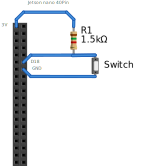

# jetson_gpio_sh
use sysfs to read gpio on jetosn, only need bash 

privieled pod is no enough in kubernetes 
should mount  `/sys/class/gpio` from host to innder pod as `/sys/class/gpio`

## read D18
do wiring

 

bash read_D18.sh